# insomnia-plugin-batch-requests

 

The Batch Requests plugin for [Insomnia](https://insomnia.rest) adds the ability to send a request repeatedly, changing parts of every request by variable data, taken from a CSV file. For every response, some data can be collected and added to the CSV file.

- Repeatedly send a request by reading data from a CSV file
- Send files too by including their file path in the CSV file
- Extract data from JSON responses (or other sources, such as the response headers, status code and time taken) and write it back to the CSV file
- Works well if not using the plugin (when sending the request manually)
- Add a delay between each request
- Run multiple requests in parallel
- Supports non-JSON responses too (but can't extract response data in such cases. Can still use response headers and status code)

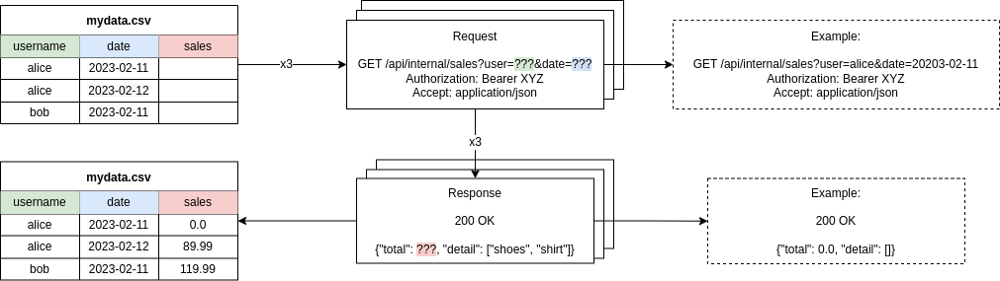

For a short demonstration, watch this:

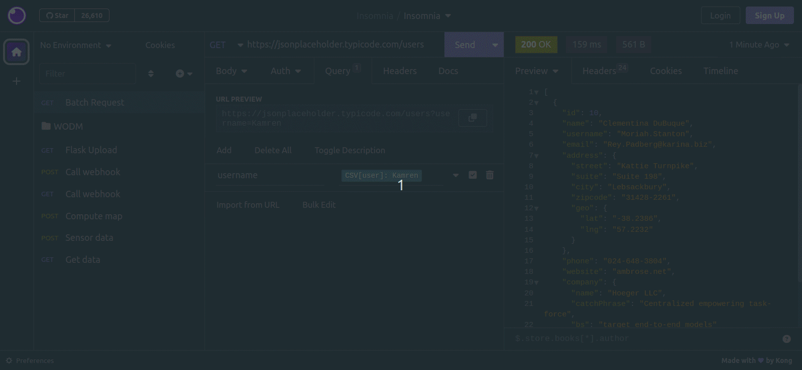

## Installing

Go to the `Application>Preferences` menu in Insomnia, then go to the `Plugins` tab, search for `insomnia-plugin-batch-requests` and install it.

> [!NOTE]
> Starting on Insomnia v11, it's also necessary to enable the **Allow elevated access for plugins** checkbox in the Plugins tab of the Insomnia preferences. Otherwise, you'll see an error like `unknown block tag: batchVariable`. See issues https://github.com/jreyesr/insomnia-plugin-batch-requests/issues/18 and https://github.com/Kong/insomnia/issues/8708.
> 
> 

## Usage

> [!NOTE]
> Want to send files in your repeated requests? See [below](#sending-files). The `Batch` tag that is described in this section sends text values only

The plugin adds a template tag to mark the places that you want to replace. To add it, press `Ctrl+Space`, search for the `Batch` tag and press `Enter`. Then, double click the tag to configure it. The tag can be inserted anywhere in the request (e.g. in the URL, query parameters, headers, or body)

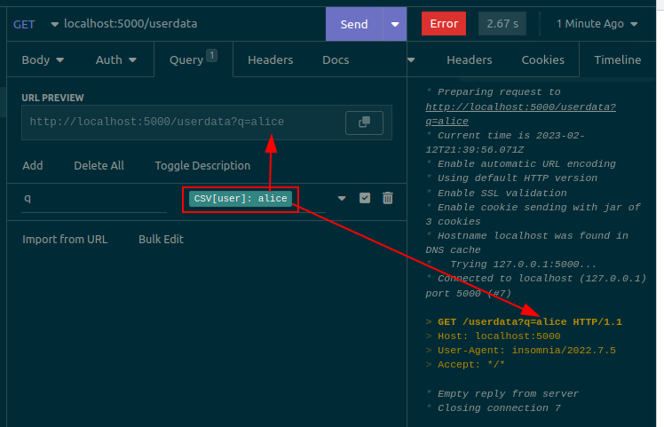

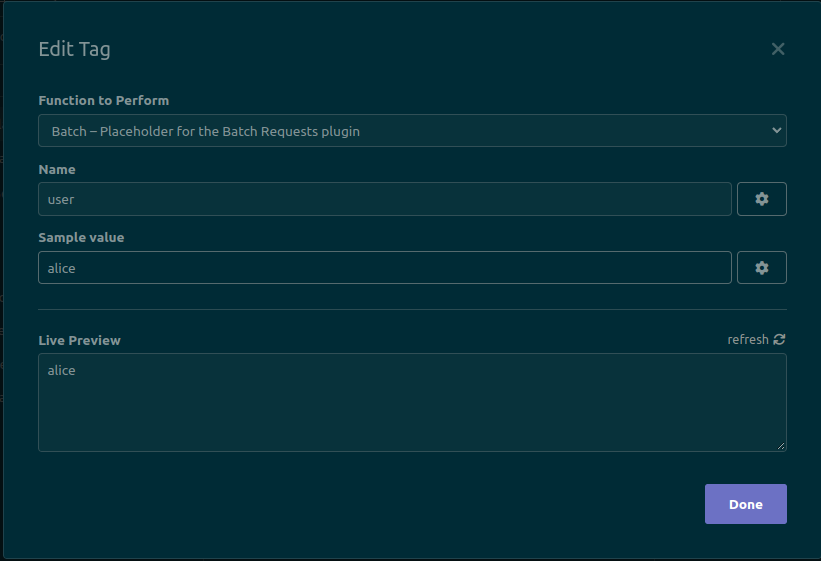

When configuring the tag, set the following two values:

- The name of the CSV column that will be replaced in this tag's location. Copy it from the first line of the CSV file, exactly (including capitalization)
- A sample value. This value will be used when sending the request manually. This is the value that you would have to edit manually if this plugin did not exist.

The live preview will always show the value of the `Sample value` field, and this same value will be replaced when sending the request manually (e.g. via Insomnia's main Send button) The value will only vary when sending the request via the Batch Request dropdown option (see below).

The plugin also adds a context menu option to all requests. To see it, click on the dropdown arrow to the right of a request on the sidebar, then select the `Batch Requests` option. This will open the plugin dialog.

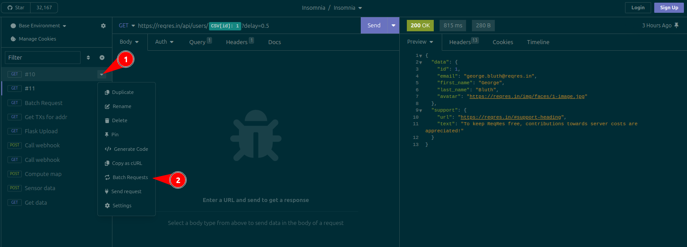

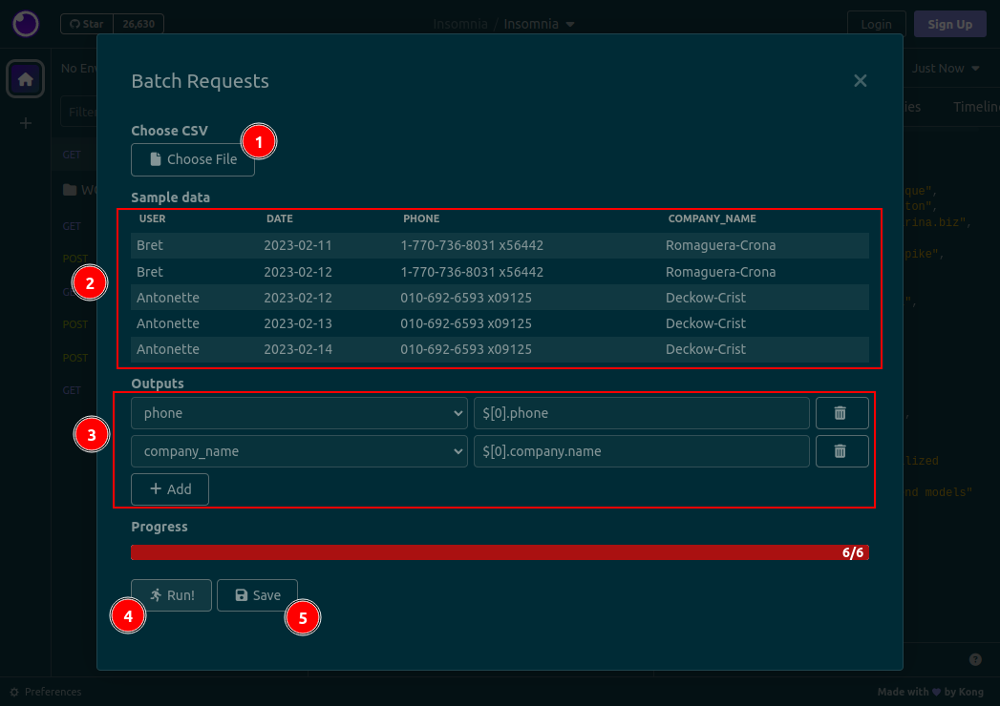

On the plugin dialog, you should:

1. Select a CSV file using the button. The file should have one column for each different placeholder/template tag that you have selected, plus one column for each result that you want to extract from the responses. The response/output columns can be empty, since they will be filled by the plugin.
2. Review the loaded data in the table. It will show the first five rows of the CSV file. It is provided as a sanity check, so that you can verify that the CSV is being parsed correctly.
3. (Optional) Configure the data that you want to output by adding `Outputs`:
   - Use the dropdowns on the left to specify a CSV column
   - Use the dropdowns on the middle to specify from where the data will be collected. See [below](#sources-of-output-data) for the available sources
   - If data is being read from the response body, write a JSONPath expression in the text fields on the right. In the image below, the `$.total` field will be written to the `sales` column in the CSV file. This plugin uses [the `jsonpath-plus` syntax](https://www.npmjs.com/package/jsonpath-plus), which is [also used by Insomnia](https://docs.insomnia.rest/insomnia/responses#filter)
   - If data is being read from the response headers, write a header name in the text fields on the right. For example, write `content-length` to fetch the response's length. This field is case-insensitive (i.e. you don't need to match the exact casing returned by the server)
4. If desired, specify a delay between requests, or a number of parallel requests. By default, no delay is applied, and requests are sent in sequence (one after the other, with no parallelization). See [below](#extra-settings) for more information.
5. Click the `Run!` button at the bottom of the dialog. It will only become active when you have chosen a file and (if any outputs exist) completely filled all Outputs.
6. Click the `Save` button to write the extracted data back to the CSV file, if you need it. Wait until all requests have been performed (as indicated by the progress bar) before clicking this button.

### Sending files

Since `v1.5.0`, it's possible to also send _files_ that vary on each request, just like before it was possible to send _text_ that varied.

For example, this could be useful to upload several files at once to Google Drive: just prepare a CSV that lists the paths to the files and any other data that must vary per file (e.g. the file's title), and then run the request several times.

The CSV must look like this (it must contain a column, here called `fname`, that lists absolute file paths):

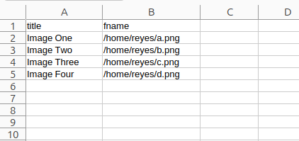

Then, create a request on Insomnia. Set its Body to Multipart. Add a new field to the body. Insert a `Batch (File)` template tag: place the cursor in the Value of the field, press `Ctrl+Space`, search for `Batch (File)`, and insert it:

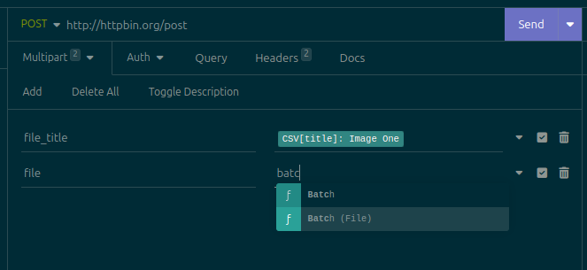

> **Warning**
> Do _not_ change the field's type to File! Leave it as Text, which is the default. If you change it to File, it isn't possible to insert template tags, since Insomnia only shows the file picker button, so you'd be forced to choose one single file for all requests

Click on the newly-added tag to open its configuration dialog:

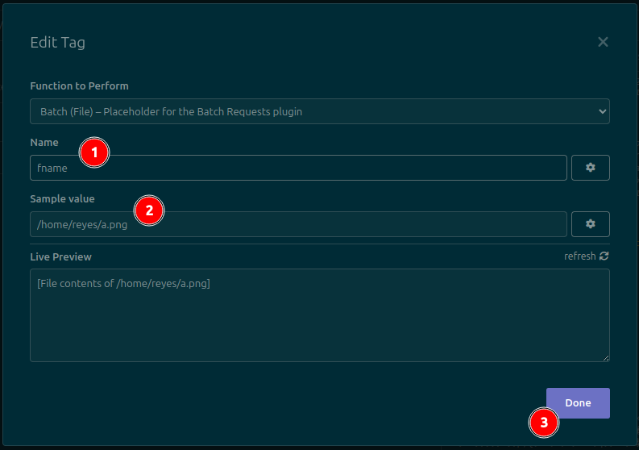

When configuring the tag, set the following two values:

- The name of the CSV column that will be replaced in this tag's location. Copy it from the first line of the CSV file, exactly (including capitalization)
- A sample value. This value will be used when sending the request manually. This is the value that you would have to edit manually if this plugin did not exist.

Click the Done button to save changes. The tag should now look like this:

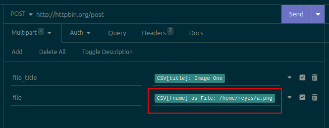

From now on, the process continues as normal (see [the Usage section above](#usage)). Click the dropdown menu for the request, select the Batch Requests option, select a CSV file, configure any desired outputs, and click Run. Any fields whose content is a Batch (File) template tag will be replaced with the _contents_ of the file whose path is contained in the configured column of the CSV file. Requests will then be sent as normal. For example, this is the third request sent with the CSV file that was shown above:

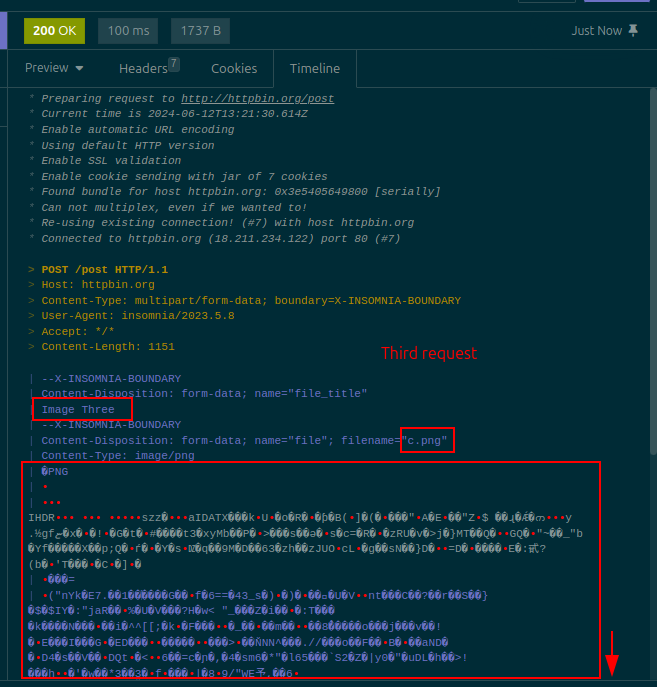

If you send the request manually (e.g. by clicking the Run button, or by pressing `Ctrl+Enter` or `F5`), the file that will be sent will be the one that was configured on the template tag's **Sample Data** field:

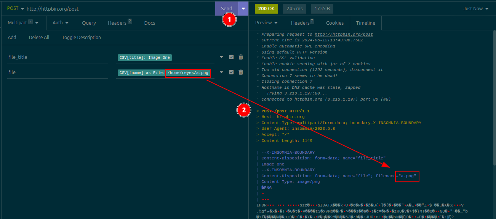

### Sources of output data

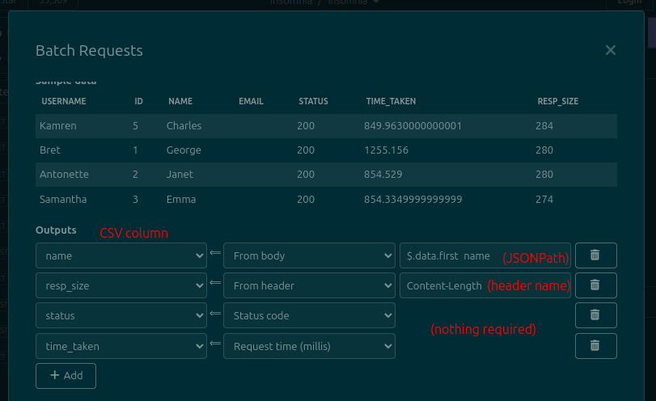

Since `v1.4.0`, it's possible to extract data from several places in the response:

- The response body (must be JSON). This is the default option and the only one available before `v1.4.0`. This option requires specifying [a JSONPath expression](https://www.npmjs.com/package/jsonpath-plus#syntax-through-examples) to extract a specific value from the JSON response, such as `$.data.id`
- The response headers. This option requires specifying a header name,
- The response status code (the numerical one, such as `200`). This option does _not_ require any further configuration
- The time taken by the request (in milliseconds). This option does _not_ require any further configuration

The source of data is chosen in the center dropdown of each Output. If required, the right-hand text field will appear and must contain something, otherwise it'll be hidden.

### Extra settings

There are two additional options that can be set when sending batch requests. They appear in the **Run Config** section, above the progress bar:

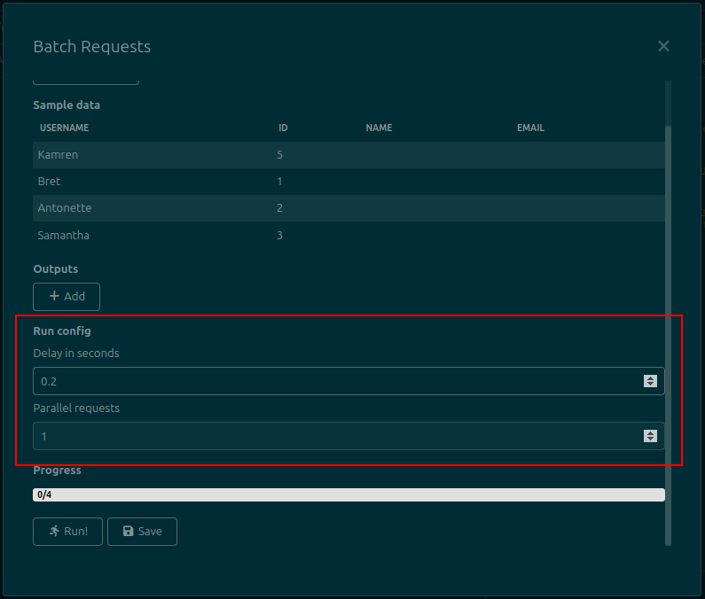

- **Delay in seconds** (available since `v1.1.0`): Inserts a delay _before_ sending each request. It's useful if the remote API enforces a rate limit or it's otherwise desired to throttle requests. By default it's set to 0. Can also be altered for the entire Request Collection (see [below](#global-configuration))
- **Parallel requests** (available since `v1.3.0`): Controls the number of requests that can be in flight at the same time. If set to a value greater than 1, it'll send multiple requests in parallel. Once a request is done, another one will start. By default it's set to 1

### Global configuration

Since `v1.2.0`, there is a Global Configuration dialog in which you can select a default request delay, in case you usually work with servers that require a delay between requests.

1. Click on the dropdown to the right of the workspace name.
2. Click the `Batch Requests: Settings` option.
3. A dialog will open, containing a number field called `Default delay`. Set its value to your preferred delay.
4. Click the Save button. It will only be enabled after you make a change to the field.
5. Dismiss the Global Configuration dialog.
6. From now on, whenever you open the main plugin dialog by right-clicking a request, the Delay field will be prefilled with your preferred delay. You can always adjust it.

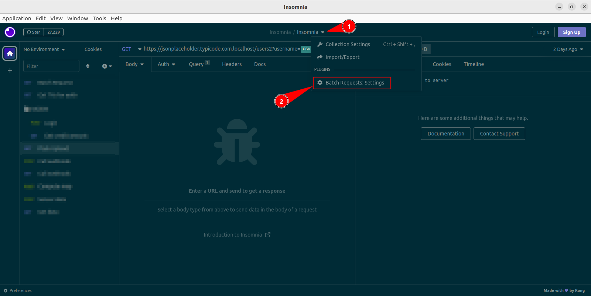

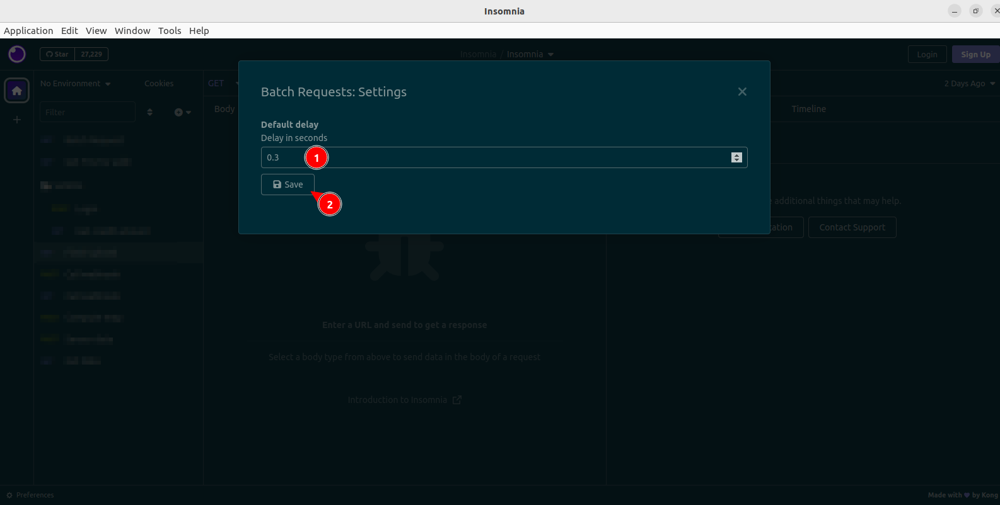

## Development

1. Identify your Insomnia plugin folder. On Ubuntu, it should be `~/.config/Insomnia/plugins`. Alternatively, open Insomnia, select the `Application>Preferences` menu, go to the Plugins tab, then click the `Reveal Plugins Folder` button.
2. On that folder, run `git clone https://github.com/jreyesr/insomnia-plugin-batch-requests`.
3. Run `npm i`.
4. Run `npm run dev`. This will start a dev server that will generate the `dist/main.js` file and keep it updated whenever you change the source files.
5. Open the Insomnia Plugins dialog (see the first step). It should display the plugin, since it's in the correct folder. It's not necessary to manually install it.
6. Create and checkout a new branch.
7. Hackity hack on the source files.
8. Whenever you save a file, the `dist/main.js` file will be updated. To make Insomnia pick up the changes, select the `Tools>Reload plugins` option from the top menus. Alternatively, press `Alt+T`, then release both, then press `R`.
9. To run tests, run `npm run test`
10. Make commit.
11. GOTO 6
12. Update the package version in `package.json` and add a new entry on `CHANGELOG.md`
13. When done, submit a PR and merge it. If releasing a new version, see [the next section](#releasing).

## Releasing

1. Ensure that the package version in `package.json` has been bumped.
2. Make all required commits, ensure that `master` has the code.
3. Create a Github Release, tag it like the version in `package.json`.
4. The CD runner should create the release and publish it.
