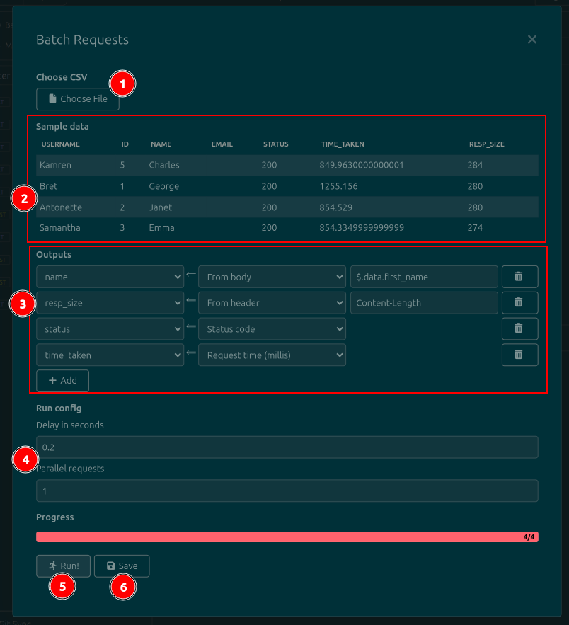

# insomnia-plugin-batch-requests

The Batch Requests plugin for [Insomnia](https://insomnia.rest) adds a context menu option that lets you send a request repeatedly, changing parts of every request by variable data, taken from a CSV file. For every response, some data can be collected and added to the CSV file. See below for a diagram:

For a short demonstration, watch this:

## Installing

Go to the `Application>Preferences` menu in Insomnia, then go to the `Plugins` tab, search for `insomnia-plugin-batch-requests` and install it.

## Usage

The plugin adds a template tag to mark the places that you want to replace. To add it, press `Ctrl+Space`, search for the `Batch` tag and press `Enter`. Then, double click the tag to configure it.

When configuring the tag, set the following two values:

* The name of the CSV column that will be replaced in this tag's location. Copy it from the first line of the CSV file, exactly (including capitalization)
* A sample value. This value will be used when sending the request manually. This is the value that you would have to edit manually if this plugin did not exist.

The live preview will always show the value of the `Sample value` field. The value will only vary when sending the request via the Batch Request dropdown option (see below).

The plugin also adds a context menu option to all requests. To see it, right-click a request, then select the `Batch Requests` option under the `Plugins` section. This will open the plugin dialog.

On the plugin dialog (see the image below), you should:

1. Select a CSV file using the button. The file should have one column for each different placeholder/template tag that you have selected, plus one column for each result that you want to extract from the responses. The response/output columns can be empty, since they will be filled by the plugin.
2. Review the loaded data in the table. It will show the first five rows of the CSV file. It is provided as a sanity check, so that you can verify that the CSV is being parsed correctly.
3. Configure the data that you want to output by adding `Outputs`. For each one, use the dropdown on the left to specify a CSV column, and write a JSONPath expression in the text field on the right. In the image below, the `$.total` field will be extracted to the `sales` column in the CSV file.
4. Click the `Run!` button at the bottom of the dialog. It will only become active when you have chosen a file and provided at least one Output.
5. Click the `Save` button to write the extracted data back to the CSV file, if you need it.

### Configuration

Since `v1.2.0`, there is a Global Configuration dialog in which you can select a default request delay, in case you usually work with servers that require a delay between requests.

1. Click on the dropdown to the right of the workspace name.
2. Click the `Batch Requests: Settings` option.
3. A dialog will open, containing a number field called `Default delay`. Set its value to your preferred delay.
4. Click the Save button. It will only be enabled after you make a change to the field.
5. Dismiss the Global Configuration dialog.
6. From now on, whenever you open the main plugin dialog by right-clicking a request, the Delay field will be prefilled with your preferred delay. You can always adjust it.

## Development

1. Identify your Insomnia plugin folder. On Ubuntu, it should be `~/.config/Insomnia/plugins`. Alternatively, open Insomnia, select the `Application>Preferences` menu, go to the Plugins tab, then click the `Reveal Plugins Folder` button.
2. On that folder, run `git clone https://github.com/jreyesr/insomnia-plugin-batch-requests`.
3. Run `npm i`.
3. Run `npm run dev`. This will start a dev server that will generate the `dist/main.js` file and keep it updated whenever you change the source files.
4. Open the Insomnia Plugins dialog (see the first step). It should display the plugin, since it's in the correct folder. It's not necessary to manually install it.
5. Create and checkout a new branch.
6. Hackity hack on the source files.
7. Whenever you save a file, the `dist/main.js` file will be updated. To make Insomnia pick up the changes, select the `Tools>Reload plugins` option from the top menus. Alternatively, press `Alt+T`, then release both, then press `R`.
8. Make commit.
9. GOTO 6
10. Update the package version in `package.json`.
11. When done, submit a PR and merge it. The CD should pick it up, compile a package and upload it to NPM.

## Releasing

1. Ensure that the package version in `package.json` has been bumped.
2. Make all required commits, ensure that `master` has the code.
3. Create a Github Release, tag it like the version in `package.json`.
4. The CD runner should create the release and publish it.